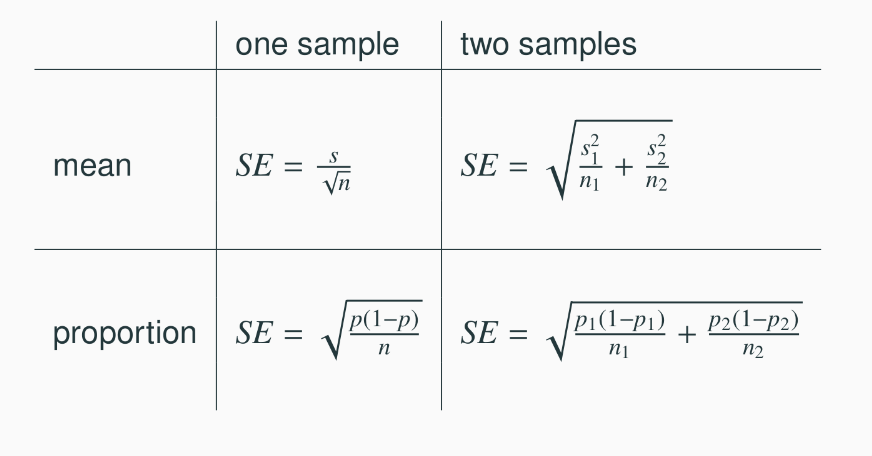

<style>
citation {
  font-size: 4px;
}
</style>

```{r setup, include=FALSE}
knitr::opts_chunk$set(echo = TRUE)
```

# Inference for a Single Proportion

## Parameter and Point Estimation

<span id="highlight">Parameter of Interest</span>: Proportion of **all** [whatever your data is]

**p**: a population proportion

<span id="highlight">Point Estimate</span>: proportion of **sampled**  [whatever your data is]

**$\hat{p}$**: a sample proportion

## Formula: SE of a Point Estimate $\hat{p}$

When we have a **sample proportion**, the standard error has a known formula:

$$
\text{SE}_{\hat{p}} = \sqrt{\frac{p(1-p)}{n}}
$$

What are $p$ and $n$?

1. $n$ is the number of samples (it's a **sample proportion**)
2. $p$ is the true underlying population proportion ...

But we don't know $p$!

We "cheat" here, and replace $p$ with $\hat{p}$ or $p0$.

## Sample Proportions are Almost Normally Distributed

Remember the Central Limit Theorem (CLT).

Sample proportions will be nearly normally distributed with mean equal to the population mean, $p$, and standard error equal to $\text{SE}_\hat{p}$ from the last slide. We can write this formally.

$$
\hat{p} \sim \mathcal{N} \left( \text{mean} = p, \text{SE} = \sqrt{\frac{p(1-p)}{n}} \right)
$$

But, of course, this is only true under certain conditions ... same ones as usual!

## Actual Rule for Checking

There is a rule of thumb for what "enough samples" means for a sample proportion inference:

1. At least 10 success cases
2. At least 10 failure cases

If you do not have the above, the CLT may not be a good approximation. 

* for CIs, this means **observed** (the data!)
* for HTs, this means **expected** (which means $n\cdot p_0$
and $n\cdot(1-p_0)$)

# Difference of Two Proportions

## Melting ice cap

Scientists predict that global warming may have big effects on the polar regions within the next 100 years. One of the possible effects is that the northern ice cap may completely melt. Would this bother you a great deal, some, a little, or not at all if it actually happened?

* A great deal
* Some
* A little
* Not at all


## Results from the GSS

The GSS asks the same question, below are the distributions of responses from the 2010 GSS as well as from a group of introductory statistics students at Duke University: 

$\;$          GSS   Duke
-----------   ---   ----
A great deal  454     69 
Some          124     30
A little       52      4
Not at all     50      2
Total         680    105

## Parameter and point estimate

* **Parameter of interest:** Difference between the proportions of
**all** Duke students and **all** Americans who would be bothered a
great deal by the northern ice cap completely melting.

$$
p_\text{Duke} - p_\text{USA}
$$

## Parameter and point estimate

* **Parameter of interest:** Difference between the proportions of
**all** Duke students and **all** Americans who would be bothered a
great deal by the northern ice cap completely melting.
$$
p_\text{Duke} - p_\text{USA}
$$
* **Point estimate:** Difference between the proportions of **sampled** Duke students and **sampled** Americans who would be bothered a great deal by the northern ice cap completely melting.
$$
\hat{p}_\text{Duke} - \hat{p}_\text{USA}
$$

## Inference for comparing proportions

* The details are the same as before...

## Inference for comparing proportions

* The details are the same as before...
* **CI**: $\text{point estimate} \pm \text{margin of error}$

## Inference for comparing proportions

* The details are the same as before...
* **CI**: $\text{point estimate} \pm \text{margin of error}$
* **HT**: Use $Z = \frac{\text{point estimate} - \text{null value}}{\text{SE}}$ to find appropriate p-value.

## Inference for comparing proportions

* The details are the same as before...
* **CI**: $point~estimate \pm \text{margin of error}$
* **HT**: Use $Z = \frac{\text{point estimate} - \text{null value}}{\text{SE}}$} to find appropriate p-value.
* We just need the appropriate standard error of the point estimate 
$$
SE_{ \hat{p}_\text{Duke} - \hat{p}_\text{USA}}
$$
which is the only new concept.

## Formula for SE for Difference in Proportions

Standard error of the difference between two sample proportions:

$$
SE_{(\hat{p}_1 - \hat{p}_2)} = \sqrt{ \frac{p_1(1-p_1)}{n_1} + \frac{p_2(1-p_2)}{n_2} } 
$$


# Confidence intervals for difference of proportions

## Conditions for CI for difference of proportions

* Independence **within** groups: 
    * The US group is sampled randomly and we're assuming that the Duke group represents a random sample as well.
    * $n_{Duke}$ $<$ 10\% of all Duke students and 680 $<$ 10\% of all Americans.
    
We can assume that the attitudes of Duke students in the sample are independent of each other, and attitudes of US residents in the sample are independent of each other as well.

## Conditions for CI for difference of proportions

* Independence **between** groups: 
The sampled Duke students and the US residents are independent of each other.
* **Success-failure:** At least 10 observed successes and 10 observed failures in each of the two groups.

## Practice

Construct a 95\% confidence interval for the difference between the proportions of Duke students and Americans who would be bothered a great deal by the melting of the northern ice cap ($p_\text{Duke} - p_\text{USA}$).

$\;$               GSS   Duke
-----------        ---   ----
A great deal       454     69 
Not a great deal   124     30
Total              680    105
$\hat{p}$          0.657 0.668

$$
(\hat{p}_\text{Duke} - \hat{p}_\text{USA}) \pm z^\star \times \sqrt{ \frac{ \hat{p}_\text{Duke} (1 - \hat{p}_\text{Duke})}{n_\text{Duke} } + \frac{ \hat{p}_\text{USA} (1 -  \hat{p}_\text{US})}{n_\text{US} } } 
$$

## Practice

This becomes:
```{r}
p1 <- 0.657
p2 <- 0.668
n1 <- 105
n2 <- 680
SE_CI <- sqrt( p1*(1-p1)/n1 + p2*(1-p2)/n2 )
(p1 - p2) + c(-1, 1) * qnorm(0.975) * SE_CI
```

Thus, we are 95\% confident that the true difference in proportions
for all Duke students and United States residents is between -0.1084
and +0.0865.

## HT for comparing proportions

Which of the following is the correct set of hypotheses for testing if the proportion of all Duke students who would be bothered a great deal by the melting of the northern ice cap differs from the proportion of all Americans who do?

* $H_0:  p_{Duke} = p_{US} \qquad \text{versus} \qquad H_A:  p_{Duke} \ne p_{US}$ 
* $H_0:  \hat{p}_{Duke} = \hat{p}_{US} \qquad \text{versus} \qquad H_A:  \hat{p}_{Duke} \ne \hat{p}_{US}$
* $H_0:  p_{Duke} - p_{US} = 0 \qquad \text{versus} \qquad H_A:  p_{Duke} - p_{US} \ne 0$ }
* $H_0:  p_{Duke} = p_{US} \qquad \text{versus} \qquad H_A:  p_{Duke} < p_{US}$

## HT for comparing proportions


Which of the following is the correct set of hypotheses for testing if the proportion of all Duke students who would be bothered a great deal by the melting of the northern ice cap differs from the proportion of all Americans who do?

* <span id="highlight">$H_0:  p_{Duke} = p_{US} \qquad \text{versus} \qquad H_A:  p_{Duke} \ne p_{US}$ </span>
* $H_0:  \hat{p}_{Duke} = \hat{p}_{US} \qquad \text{versus} \qquad H_A:  \hat{p}_{Duke} \ne \hat{p}_{US}$
* <span id="highlight">$H_0:  p_{Duke} - p_{US} = 0 \qquad \text{versus} \qquad H_A:  p_{Duke} - p_{US} \ne 0$ </span>
* $H_0:  p_{Duke} = p_{US} \qquad \text{versus} \qquad H_A:  p_{Duke} < p_{US}$


## Flashback to working with one proportion

* When constructing a confidence interval for a population proportion, we check if the **observed** number of successes and failures are at least 10.
$$
n\hat{p} \ge 10 \qquad \qquad n(1-\hat{p}) \ge 10
$$


## Flashback to working with one proportion

* When constructing a confidence interval for a population proportion, we check if the **observed** number of successes and failures are at least 10.
$$
n\hat{p} \ge 10 \qquad \qquad n(1-\hat{p}) \ge 10
$$
* When conducting a hypothesis test for a population proportion, we check if the **expected** number of successes and failures are at least 10.
$$
np_0 \ge 10 \qquad \qquad n(1-p_0) \ge 10
$$

## Pooled estimate of a proportion

* In the case of comparing two proportions where $H_0: p_1 = p_2$, there isn't a given null value we can use to calculated the **expected** number of successes and failures in each sample.

## Pooled estimate of a proportion

* In the case of comparing two proportions where $H_0: p_1 = p_2$, there isn't a given null value we can use to calculated the **expected** number of successes and failures in each sample.
* Therefore, we need to first find a common (**pooled**) proportion for the two groups, and use that in our analysis.

## Pooled estimate of a proportion

* In the case of comparing two proportions where $H_0: p_1 = p_2$, there isn't a given null value we can use to calculated the **expected** number of successes and failures in each sample.
* Therefore, we need to first find a common (**pooled**) proportion for the two groups, and use that in our analysis.
* This simply means finding the proportion of total successes among the total number of observations.

## Formula for Pooled Estimate

**Pooled estimate of a proportion**:

$$
\hat{p} = \frac{\#~of~successes_1 + \#~of~successes_2}{n_1 + n_2}
$$

## Practice 

Calculate the estimated **pooled proportion** of Duke students and Americans who would be bothered a great deal by the melting of the northern ice cap. Which sample proportion ($\hat{p}_\text{Duke}$ or $\hat{p}_\text{US}$) the pooled estimate is closer to? Why?

$\;$               GSS   Duke
-----------        ---   ----
A great deal       454     69 
Not a great deal   124     30
Total              680    105
$\hat{p}$          0.657 0.668

## Practice (ctd.)
```{r}
s1 <- 69
s2 <- 454  # n1 and n2 defined earlier 
pooled <- (s1 + s2) / (n1 + n2)
pooled
```

## Run the Hypothesis Test

Do these data suggest that the proportion of all Duke students who would be bothered a great deal by the melting of the northern ice cap differs from the proportion of all Americans who do? Calculate the test statistic, the p-value, and interpret your conclusion in context of the data. (with $\hat{p}_\text{pooled} = 0.666242$)

$\;$               GSS   Duke
-----------        ---   ----
A great deal       454     69 
Not a great deal   124     30
Total              680    105
$\hat{p}$          0.657 0.668

## Run the Hypothesis Test

$$
z_\text{test} = \frac{\text{point} - \text{null}}{\text{SE}} = \frac{(\hat{p}_\text{Duke} - \hat{p}_\text{USA})}{\sqrt{ \frac{ \hat{p} (1 - \hat{p})}{n_\text{Duke} } + \frac{ \hat{p} (1 -  \hat{p})}{n_\text{USA} } }}
$$

We defined all of these earlier.
```{r}
(p1 - p2) / sqrt( pooled*(1-pooled)/n1 + pooled*(1-pooled)/n2)
```

# Recap

## Recap - comparing two proportions

* Population parameter: $(p_1 - p_2)$, point estimate: $(\hat{p}_1 - \hat{p}_2)$
* Conditions:
    - independence within groups 
    - random sample and 10\% condition met for both groups
    - independence between groups
    - at least 10 successes and failures in each group
    - if not $\rightarrow$ randomization (optional topic)
    
## Recap - comparing two proportions
* $SE_{(\hat{p}_1 - \hat{p}_2)} = \sqrt{ \frac{p_1(1-p_1)}{n_1} + \frac{p_2(1-p_2)}{n_2} }$
    - for CI: use $\hat{p}_1$ and $\hat{p}_2$
    - for HT:
        + when $H_0: p_1 = p_2$: use $\hat{p}_{pool} = \frac{\#~suc_1 + \#suc_2}{n_1 + n_2}$
        + when $H_0: p_1 - p_2 = \text{(some value other than 0): use } \hat{p}_1 \text{ and } \hat{p}_2$ (this is pretty rare!!)


## Reference - standard error calculations

<center>
```{r, echo=FALSE, out.width = "650px"}

```
</center>

* When working with means, it's very rare that $\sigma$ is known, so we usually use $s$.
 
## Reference - standard error calculations

<center>
```{r, echo=FALSE, out.width = "650px"}

```
</center>

* When working with means, it's very rare that $\sigma$ is known, so we usually use $s$.
* When working with proportions, 
    - if doing a hypothesis test, $p$ comes from the null hypothesis
    - if constructing a confidence interval, use $\hat{p}$ instead