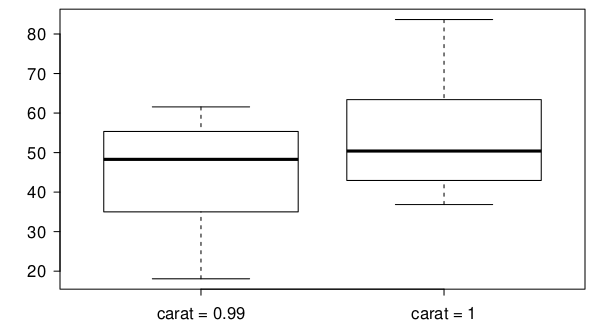

<style>
citation {
  font-size: 4px;
}
</style>

```{r setup, include=FALSE}
knitr::opts_chunk$set(echo = TRUE)
```

# Inference for a Single Mean

## Parameter and Point Estimation

<span id="highlight">Parameter of Interest</span>: Mean of **all** [whatever your data is]

**$\mu$**: a population proportion

<span id="highlight">Point Estimate</span>: Average of **sampled**  [whatever your data is]

**$\bar{x}$**: a sample mean

## Formula: SE of a Point Estimate $\bar{x}$

When we have a **sample mean**, the standard error has a known formula:

$$
\text{SE}_{\bar{x}} = \frac{\sigma}{\sqrt{n}} \approx \frac{s}{\sqrt{n}}
$$

What are $\mu$ and $n$?

1. $n$ is the number of samples (it's a **sample mean**)
2. $$\mu$$ is the true underlying population mean ...

## Sample Means are Almost Normally Distributed

Remember the Central Limit Theorem (CLT).

Sample means will be nearly normally distributed with mean equal to the population mean, $\mu$, and standard error equal to $\text{SE}_\bar{x}$ from the last slide. We can write this formally.

$$
\bar{x} \sim \mathcal{N} \left( \text{mean} = \mu, \text{SE} = \frac{\sigma}{\sqrt{n}} \right)
$$

But, of course, this is only true under certain conditions ... same ones as usual!

# Difference of Two Means

## Example: Diamonds

* Weights of diamonds are measured in carats. 
* 1 carat = 100 points, 0.99 carats = 99 points, etc.
* The difference between the size of a 0.99 carat diamond and a 1 carat diamond is undetectable to the naked human eye, but does the price of a 1 carat diamond tend to be higher than the price of a 0.99 diamond?
* We are going to test to see if there is a difference between the average prices of 0.99 and 1 carat diamonds.
* In order to be able to compare equivalent units, we divide the prices of 0.99 carat diamonds by 99 and 1 carat diamonds by 100, and compare the average point prices.

```{r, echo=FALSE, out.width = "250px"}

```

## Data

<center>
```{r, echo=FALSE, out.width = "450px"}

```
</center>

$\;$       0.99 carat     1 carat
------     -----------    ---------
$\bar{x}$  44.50          53.43
$s$        13.32          12.22
$n$        23             30

(variables are **pt99** and **pt100**, respectively)

## Data (Source)

These data are a random sample from the **diamonds** data set in **ggplot2** R package. If you'd like to explore it,

```{r, warning = FALSE, error = FALSE}
library("ggplot2")
data(diamonds)
```

## Parameter and point estimate

* **Parameter of interest:** Average difference between the point prices of **all** 0.99 carat and 1 carat diamonds.
$$
\mu_{pt99} - \mu_{pt100} 
$$
* **Point estimate:** Average difference between the point prices of **sampled** 0.99 carat and 1 carat diamonds.
$$
\bar{x}_{pt99} - \bar{x}_{pt100}
$$

## Hypotheses

Which of the following is the correct set of hypotheses for testing if the average point price of 1 carat diamonds ($_{pt100}$) is higher than the average point price of 0.99 carat diamonds ($_{pt99}$)?}

* $H_0: \mu_{pt99} = \mu_{pt100} \qquad \text{versus} \qquad  H_A: \mu_{pt99} \ne \mu_{pt100}$
* $H_0: \mu_{pt99} = \mu_{pt100}\qquad \text{versus} \qquad  H_A: \mu_{pt99} > \mu_{pt100}$
* $H_0: \mu_{pt99} = \mu_{pt100}\qquad \text{versus} \qquad  H_A: \mu_{pt99} < \mu_{pt100}$ 
* $H_0: \bar{x}_{pt99} = \bar{x}_{pt100}\qquad \text{versus} \qquad H_A: \bar{x}_{pt99} < \bar{x}_{pt100}$

## Hypotheses

Which of the following is the correct set of hypotheses for testing if the average point price of 1 carat diamonds ($_{pt100}$) is higher than the average point price of 0.99 carat diamonds ($_{pt99}$)?}

* $H_0: \mu_{pt99} = \mu_{pt100} \qquad \text{versus} \qquad  H_A: \mu_{pt99} \ne \mu_{pt100}$
* $H_0: \mu_{pt99} = \mu_{pt100}\qquad \text{versus} \qquad  H_A: \mu_{pt99} > \mu_{pt100}$
* <span id="highlight">$H_0: \mu_{pt99} = \mu_{pt100}\qquad \text{versus} \qquad  H_A: \mu_{pt99} < \mu_{pt100}$ </span>
* $H_0: \bar{x}_{pt99} = \bar{x}_{pt100}\qquad \text{versus} \qquad H_A: \bar{x}_{pt99} < \bar{x}_{pt100}$

## Conditions

Which of the following does **not** need to be satisfied in order to conduct this hypothesis test using theoretical methods?

* Point price of one 0.99 carat diamond in the sample should be independent of another, and the point price of one 1 carat diamond should independent of another as well.
* Point prices of 0.99 carat and 1 carat diamonds in the sample should be independent.
* Distributions of point prices of 0.99 and 1 carat diamonds should not be extremely skewed.
* Both sample sizes should be at least 30.

## Conditions

Which of the following does **not** need to be satisfied in order to conduct this hypothesis test using theoretical methods?

* Point price of one 0.99 carat diamond in the sample should be independent of another, and the point price of one 1 carat diamond should independent of another as well.
* Point prices of 0.99 carat and 1 carat diamonds in the sample should be independent.
* Distributions of point prices of 0.99 and 1 carat diamonds should not be extremely skewed.
* <span id="highlight">Both sample sizes should be at least 30.</span>


# Sampling distribution for the difference of two means

## Test statistic

Test statistic for inference on the difference of two small sample means:

The test statistic for inference on the difference of two means where $\sigma_1$ and $\sigma_2$ are unknown is the $T$ statistic:
$$
T_{df} = \frac{\text{point estimate} - \text{null value}}{SE} 
$$
where 
$$
SE = \sqrt{ \frac{s_1^2}{n_1} + \frac{s_2^2}{n_2} } \qquad \text{ and } \qquad df = min(n_1 - 1, n_2 - 1) 
$$

The calculation of the $df$ is actually **much** more complicated. For simplicity we'll use the above formula to **estimate** the true $df$ when conducting the analysis by hand. See SLIDE BLAH FOR MORE.

## Test statistic (cont.)

$\;$       0.99 carat     1 carat
------     -----------    ---------
$\bar{x}$  44.50          53.43
$s$        13.32          12.22
$n$        23             30

<br/>
in context...

## Test statistic (cont.)

$\;$       0.99 carat     1 carat
------     -----------    ---------
$\bar{x}$  44.50          53.43
$s$        13.32          12.22
$n$        23             30

<br/>
in context...

$$
T = \frac{\text{point estimate} - \text{null value} }{SE} = \frac{(44.50 - 53.43) - 0}{ \sqrt{\frac{13.32^2}{23} + \frac{12.22^2}{30} }} 
$$

## Doing It

```{r}
s1 <- 13.32
n1 <- 23
s2 <- 12.22
n2 <- 30
xbar1 <- 44.50
xbar2 <- 53.43
SE <- sqrt( s1^2/n1 + s2^2/n2 )
h0 <- 0
T <- ((xbar1 - xbar2) - h0) / SE
T
```

## Test statistic (cont.)

Which of the following is the correct $df$ for this hypothesis test?

* 22 
* 23
* 30
* 29
* 52

## Test statistic (cont.)

Which of the following is the correct $df$ for this hypothesis test?

* <span id="highlight">22</span>
* 23
* 30
* 29
* 52

$$
df = \text{min}(n_{pt99} - 1, n_{pt100} - 1) = \text{min}(23-1, 30-1) = 22.
$$


## p-value

We know the p-value and the test statistic: let's do this!

$$
T = -2.508 \qquad df = 22
$$
```{r}
pt(q = -2.508, df = 22, lower.tail = TRUE)
```

We use lower.tail = TRUE because the alternative was $H_A: \mu_{pt99} < \mu_{pt100}$.


## Synthesis

What is the conclusion of the hypothesis test? How (if at all) would this conclusion change your behavior if you went diamond shopping?

* p-value is small so reject $H_0$. The data provide convincing evidence to suggest that the point price of 0.99 carat diamonds is lower than the point price of 1 carat diamonds.
* Maybe buy a 0.99 carat diamond? It looks like a 1 carat, but is significantly cheaper.


# Confidence intervals for the difference of two means

## Equivalent confidence level

What is the equivalent confidence level for a one-sided hypothesis test at $\alpha = 0.05$?

<div style = "float: left; display: block; width: 30%;">
* 90\%
* 92.5\%
* 95\%
* 97.5\%
</div>
<div style="float: right; position: relative; display: block; width: 60%;">
```{r, echo = FALSE, warning = FALSE, error = FALSE, message = FALSE, fig.height = 4, fig.width = 6}
library(openintro)
plot(c(-4, 4), c(0, dnorm(0)), type='n', axes=FALSE, ylab = "", xlab = "")
axis(1, at = c(-5,-1.72, 0, 1.72, 5), labels = c(NA, NA, 0, NA, NA))
abline(h=0)

X <- seq(-8, 8, 0.01)
Y <- dt(X, 9)
lines(X, Y)

these <- which(X < -1.72)
yy <- c(0, Y[these], 0)
these <- c(these[1], these, rev(these)[1])
xx <- X[these]
polygon(xx, yy, col=COL[1])

these <- which(X > 1.72)
yy <- c(0, Y[these], 0)
these <- c(these[1], these, rev(these)[1])
xx <- X[these]
polygon(xx, yy, col=COL[1])

text(0,0.6*max(Y), "90%", col = "red", cex = 0.9)
text(2,0.05*max(Y), "5%", col = "red", cex = 0.8)
text(-2,0.05*max(Y), "5%", col = "red", cex = 0.8)
```
</div>


## Equivalent confidence level

What is the equivalent confidence level for a one-sided hypothesis test at $\alpha = 0.05$?

* <span id="hightlight">90\%</span>
* 92.5\%
* 95\%
* 97.5\%

One-sided tests with specific alpha aren't identical to the corresponding confidence levels!

## Critical value

What is the appropriate $t^\star$ for a confidence interval for the average difference between the point prices of 0.99 and 1 carat diamonds?

* 1.32
* 1.72
* 2.07
* 2.82

```{r}
qt(p = (1 - 0.90) / 2, df = 22, lower.tail = FALSE)
```

## Confidence interval

Calculate the interval, and interpret it in context.

$$
\text{point estimate} \pm ME 
$$

Filled in, this is:
$$
(\bar{x}_{pt99} - \bar{x}_{pt1}) \pm t^\star_{df} \times SE = (44.50 - 53.43) \pm 1.72 \times 3.56 
$$

```{r}
(44.50 - 53.43) + c(-1, 1) * 1.717144 * 3.56
```

Thus, we are 90\% confident that the average point price of a 0.99 carat diamond is \$15.04 to \$2.82 lower than the average point price of a 1 carat diamond.

## Recap: Inference using difference of two small sample means

* If $\sigma_1$ or $\sigma_2$ is unknown, difference between the sample means follow a $t$-distribution with $SE = \sqrt{ \frac{s_1^2}{n_1} + \frac{s_2^2}{n_1} }$.
* Conditions: 
    - independence within groups (often verified by a random sample, and if sampling without replacement, $n < $ 10\% of population) and between groups
    - no extreme skew in either group
    
## Recap: Inference using difference of two small sample means

* Hypothesis testing: 
$$
T_{df} = \frac{\text{point estimate} - \text{null value}}{SE}\text{, where }df = min(n_1 - 1, n_2 - 1)
$$
* Confidence interval:
$$
\text{point estimate} \pm t_{df}^\star \times SE 
$$

# Advanced: Using R, Skipping the df Approximation

## Advanced Option

We used an approximation for the degrees-of-freedom in the earlier discussion,
because we needed a convenient way to approximate the df without using a really
complicated formula. However, when you're using the built-in functions in R,
it does it for you!

So, in this example, we'll show you how this might shake out. The only things that
get influenced are p-values (for hypothesis tests) and the critical (star) 
values (for confidence intervals). 

## Some Data

In a spreadsheet called grades.csv, I have saved a random sample of final
(completely anonymous!) grades from MATH 1051H (Fall, 2019) and MATH 1051H
(Summer, 2019). Just grades, no student info. I'm interested in whether
the overall average performance is the same between Fall and Summer. Let's 
do a test!

```{r}
grades <- read.csv("grades.csv", header = TRUE)
str(grades)
```

## Manually

I assume:
$$
H_0: \mu_1 - \mu_2 = 0 \qquad \text{versus} \qquad H_A: \mu_1 - \mu_2 \neq 0
$$

```{r}
xbar1 <- mean(grades$Fall, na.rm = TRUE)
s1 <- sd(grades$Fall, na.rm = TRUE)
n1 <- length(which(!is.na(grades$Fall)))
xbar2 <- mean(grades$Summer, na.rm = TRUE)
s2 <- sd(grades$Summer, na.rm = TRUE)
n2 <- length(which(!is.na(grades$Summer)))
SE <- sqrt( s1^2/n1 + s2^2/n2 )
h0 <- 0
T <- ((xbar1 - xbar2) - h0) / SE
T
```

## Conclusion (Manual)

So we compute the p-value:

```{r}
df <- min(n1 - 1, n2 - 1)
pt(T, df = df, lower.tail = TRUE) * 2
```

So this p-value is large, and we fail to reject the null: we do not have evidence of
a difference in the average final grade for MATH 1051H for Fall versus Summer.

## Automatic

```{r}
t.test(x = grades$Fall, y = grades$Summer, 
       alternative = "two.sided", mu = 0)
```
See the output? We get exactly the same test statistic, but the df is 
estimated to be 72.951 instead of the smaller of $n_1 - 1$ and $n_2 - 1$.
This changes the p-value from 0.6085 to 0.6067.

## Conclusion

**So** be careful and use the method indicated by the problem you're doing. 
Mostly, we will use the simple approximation, but look for WeBWorK problems
that tell you not to do this!

