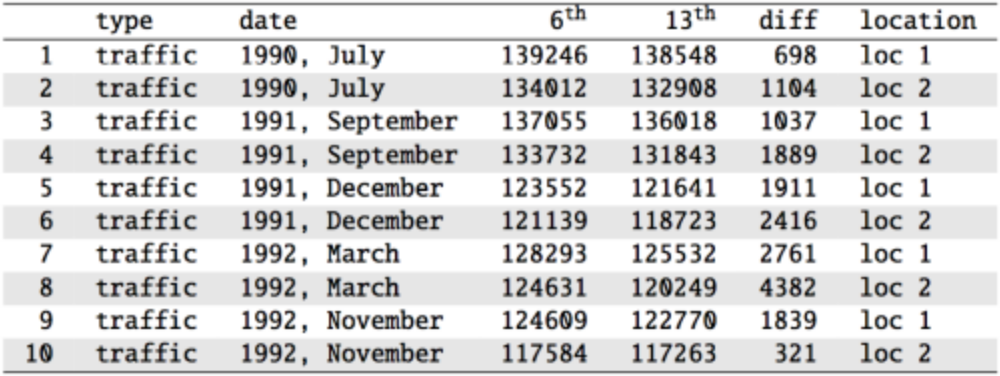

<style>
citation {
  font-size: 4px;
}
</style>

```{r setup, include=FALSE}
knitr::opts_chunk$set(echo = TRUE)
```

# Inference for Paired Means

## Our New Case

In our previous lectures, we're reviewed hypothesis tests on a single sample 
and its mean ($\bar{x}$), and hypothesis tests on two samples and the difference
of their means ($\bar{x}_1 - \bar{x}_2$).

In this lecture, we're going to talk about one more example of this kind of test:
differences of means, from two samples, but with a special twist - the data is
**paired**.

## What does Pairing Mean?

**Paired data** occurs when we have two samples, and the samples somehow have a
link so that each element of one sample has a natural pair in another sample. Here
are some examples:

* Daily total sales from a convenience store in June of 2019 and June of 2020
* Hourly traffic from Highway 115 for June 24th and July 1st of 2020
* Final grades for fourth-year high school students in English and Math

Can you see what the pairing unit is across these sets?

## The Rule

We normally compare two sets by taking the average of each, and then comparing those
averages. However, when the data are paired, that no longer makes sense, because
the sets **are not independent**.

So, when the data is naturally paired, we can't use our previous test, and need a new one!

## Parameter and Point Estimation

<span id="highlight">Parameter of Interest</span>: Mean Difference of **all** [whatever your data is]

**$\mu$**: the population-level mean difference (paired)

<span id="highlight">Point Estimate</span>: Average difference of **sampled**  [whatever your data is]

**$\bar{x}$**: a sample mean difference (paired)


## Case Study: Friday the 13th

Between 1990 - 1992 researchers in the UK collected data on traffic flow, accidents, and hospital admissions on Friday 13th and the previous Friday, Friday 6th. Below is an excerpt from this data set on traffic flow. We can assume that traffic flow on a given day at locations 1 and 2 are independent.

<center>
```{r, out.width = "750px", echo = FALSE}

```
</center>
<span id="footnote">Scanlon, T.J., Luben, R.N., Scanlon, F.L., Singleton, N. (1993), “Is Friday the 13th Bad For Your Health?” BMJ, 307, 1584-1586.</span>

## Friday the 13th

We want to investigate if people's behavior is different on Friday 13th compared to Friday 6th.
One approach is to compare the traffic flow on these two days.

  * $H_0$: Average traffic flow on Friday 6th and 13th are equal.
  * $H_A$: Average traffic flow on Friday 6th and 13th are different.
  
Each case in the data set represents traffic flow recorded at the same location in the same month of the same year: one count from Friday 6th and the other Friday 13th. Are these two counts independent?

## Friday the 13th

We want to investigate if people's behavior is different on Friday 13th compared to Friday 6th.
One approach is to compare the traffic flow on these two days.

  * $H_0$: Average traffic flow on Friday 6th and 13th are equal.
  * $H_A$: Average traffic flow on Friday 6th and 13th are different.
  
Each case in the data set represents traffic flow recorded at the same location in the same month of the same year: one count from Friday 6th and the other Friday 13th. Are these two counts independent?

**No**

## Hypotheses

What are the hypotheses for testing for a difference between the average traffic flow between Friday 6th and 13th?

  * $H_0: \mu_\text{6th} = \mu_\text{13th} \qquad \text{versus} \qquad H_A: \mu_\text{6th} \neq \mu_\text{13th}$
  * $H_0: p_\text{6th} = p_\text{13th} \qquad \text{versus} \qquad H_A: p_\text{6th} \neq p_\text{13th}$
  * $H_0: \mu_\text{diff} = 0 \qquad \text{versus} \qquad H_A: \mu_\text{diff} \neq 0$
  * $H_0: \bar{x}_\text{diff} = 0 \qquad \text{versus} \qquad H_A: \bar{x}_\text{diff} \neq 0$

## Hypotheses 

What are the hypotheses for testing for a difference between the average traffic flow between Friday 6th and 13th?

  * $H_0: \mu_\text{6th} = \mu_\text{13th} \qquad \text{versus} \qquad H_A: \mu_\text{6th} \neq \mu_\text{13th}$
  * $H_0: p_\text{6th} = p_\text{13th} \qquad \text{versus} \qquad H_A: p_\text{6th} \neq p_\text{13th}$
  * <span id="highlight">$H_0: \mu_\text{diff} = 0 \qquad \text{versus} \qquad H_A: \mu_\text{diff} \neq 0$</span>
  * $H_0: \bar{x}_\text{diff} = 0 \qquad \text{versus} \qquad H_A: \bar{x}_\text{diff} \neq 0$

## A Plot of the Data
<center>
```{r, out.width = "750px", echo = FALSE}

```
</center>

## Conditions

**Independence**: we are told to assume that the cases (rows in the table) are independent

**Sample size/skew**: the sample distribution, shown on the last slide, does not seem to be extremely skewed, but it's very  difficult to assess with such a small sample size. We might want to think about whether we would expect the population distribution to be skewed or not -- probably not, as it should be equally likely to have days with lower than average traffic and higher than average traffic.

**Note**: $n < 30$!

So what do we do when the sample size is small? **Use a t!**

## Computing the Statistics
<center>
```{r, out.width = "750px", echo = FALSE}

```
</center>

We have, from this table:

* $\bar{x}_\text{diff} = 1836$
* $s_\text{diff} = 1176$
* $n=10$

## Finding the test statistic

<div style="margin-top: -40px;">
The test statistic for inference on a small-sample mean ($n<50$) is the $t$ statistic with $df = n-1$.

$$
t_\text{df} = \frac{\text{point estimate} - \text{null value}}{SE}
$$
In this context, these become:

* Point Estimate: $\bar{x}_\text{diff} = 1836$
* SE: $SE = \frac{s_\text{diff}}{\sqrt{n}} = \frac{1176}{\sqrt{10}} = 371.88$
* $t$: $t = \frac{1836 - 0}{371.88} = 4.937$
* $df$: $df = 10- 1 = 9$

**Note**: the null value is $0$ here because the null hypothesis we set at the start of the lecture is $\mu_\text{diff} = 0$.
</div>

## Finding the p-value

The p-value of this test statistic is, again, the tail area under the null (*t*) distribution.

```{r}
2 * pt(4.937, df = 9, lower.tail = FALSE)
```

Since this p-value is smaller than an arbitrary $\alpha = 0.05$, we would conclude at a 95% level of significance that our mean difference is **not** 0. Thus, the data provide convincing evidence of a difference between traffic flow on Friday the 6th and Friday the 13th. 

## What is the difference?
We concluded that there is a difference in the traffic flow between Friday 6th and 13th.

But it would be more interesting to find out what exactly this difference is.

We can use a confidence interval to estimate this difference.

## Confidence intervals for a small-sample mean

Confidence intervals are always of the form
$$
   \text{point estimate} \pm \text{ME}
$$

ME is always calculated as the product of a critical value (remember: $z^*$) and SE.

Since small-sample means follow a $t$ distribution (and not a $z$ distribution), the critical value is a $t^*$
(as opposed to a $z^*$).

$$
 \text{point estimate} \pm t^* \times \text{SE}
$$

## Finding the critical $t^*$

Since $n=10$, we have $df = 10 - 1 = 9$. 

```{r}
qt(0.025, df = 9)
qt(0.975, df = 9)
```

## Practice

Which of the following is the correct calculation of a 95% confidence interval for the difference between the traffic flow between Friday 6th and 13th?

$\bar{x}_\text{diff} = 1836$, $s_\text{diff} = 1176$ and $n = 10$, with $SE = 371.88$.

  * $1836 \pm 1.96 \times 372$
  * $1836 \pm 2.26 \times 372$
  * $1836 \pm 2.26 \times 1176$
  
## Practice

Which of the following is the correct calculation of a 95% confidence interval for the difference between the traffic flow between Friday 6th and 13th?

$\bar{x}_\text{diff} = 1836$, $s_\text{diff} = 1176$ and $n = 10$, with $SE = 371.88$.

  * $1836 \pm 1.96 \times 372$
  * <span id="highlight">$1836 \pm 2.26 \times 372 \longrightarrow (995, 2677)$</span>
  * $1836 \pm 2.26 \times 1176$
  
## Interpreting the CI

Which of the following is the best interpretation for the confidence interval we just calculated?
$$
\mu_\text{diff: 6th - 13th} = (995, 2677)
$$

We are 95% confident that ...

* the difference between the average number of cars on the road on Friday 6th and 13th is between 995 and 2,677.
* on Friday 6th there are 995 to 2,677 fewer cars on the road than on the Friday 13th, on average.
* on Friday 6th there are 995 fewer to 2,677 more cars on the road than on the Friday 13th, on average.
* on Friday 13th there are 995 to 2,677 fewer cars on the road than on the Friday 6th, on average.
  
## Interpreting the CI

Which of the following is the best interpretation for the confidence interval we just calculated?
$$
\mu_\text{diff: 6th - 13th} = (995, 2677)
$$

We are 95% confident that ...

* the difference between the average number of cars on the road on Friday 6th and 13th is between 995 and 2,677.
* on Friday 6th there are 995 to 2,677 fewer cars on the road than on the Friday 13th, on average.
* on Friday 6th there are 995 fewer to 2,677 more cars on the road than on the Friday 13th, on average.
* <span id="highlight">on Friday 13th there are 995 to 2,677 fewer cars on the road than on the Friday 6th, on average</span>.

## One Final Note

**Note**: The example we used was for paired means (difference between dependent groups). We took the difference between the observations and used only these differences (one sample) in our analysis, therefore the mechanics are the same as when we are working with just one sample.

## Case Study 2: High School Grades
200 observations were randomly sampled from the *High School and Beyond* survey. The same students took a reading and writing test and their scores are shown below. At a first glance, does there appear to be a difference between the average reading and writing test score?

<center>
```{r, out.width = "550px", echo = FALSE}

```
</center>

## Paired Observations
The same students took a reading and writing test and their scores are shown below. Are the reading and writing scores of each student independent of each other?
<center>
```{r, out.width = "350px", echo = FALSE}

```
</center>

(a) Yes       (b) No

## Paired Observations
The same students took a reading and writing test and their scores are shown below. Are the reading and writing scores of each student independent of each other?
<center>
```{r, out.width = "350px", echo = FALSE}

```
</center>

(a) Yes       <span id="highlight">(b) No</span>

## Analyzing Paired Data

As we mentioned earlier, when two sets of observations have this special correspondence (not independent), they are said to be **paired**.

To analyze paired data, it is often useful to look at the difference in outcomes of each pair of observations.
$$
		\text{diff} = \text{read - write}
$$
It is important that we always subtract using a consistent order, from student to student or patient to patient, or whatever our operational unit is.

<center>
```{r, out.width = "700px", echo = FALSE}

```
</center>

## Parameter and Point Estimate

**Parameter of interest**: Average difference between the reading and writing scores of **all** high school students.
$$
		\mu_\text{diff}
$$

**Point estimate**: Average difference between the reading and writing scores of **sampled** high school students.
$$
			\bar{x}_\text{diff}
$$

## Setting the Hypotheses

If in fact there was no difference between the scores on the reading and writing exams, what would you expect the average difference to be?
$$
0
$$
What are the hypotheses for testing if there is a difference between the average reading and writing scores?

$$
H_0: \text{There is no difference between the}\\
\text{average reading and writing score,} \mu_\text{diff} = 0
$$
versus
$$
H_A: \text{There is a difference between the}\\
\text{average reading and writing score,} \mu_\text{diff} \neq 0
$$

## Checking assumptions and conditions
Which of the following is true?

* Since students are sampled randomly and are less than 10% of all high school students, we can assume that the difference between the reading and writing scores of one student in the sample is independent of another.
* The distribution of differences is bimodal, therefore we cannot continue with the hypothesis test.
* In order for differences to be random we should have sampled with replacement.
* Since students are sampled randomly and are less than 10% of all students, we can assume that the sampling distribution of the average difference will be nearly normal.

## Checking assumptions and conditions
Which of the following is true?

* <span id="highlight">Since students are sampled randomly and are less than 10% of all high school students, we can assume that the difference between the reading and writing scores of one student in the sample is independent of another.</span>
* The distribution of differences is bimodal, therefore we cannot continue with the hypothesis test.
* In order for differences to be random we should have sampled with replacement.
* Since students are sampled randomly and are less than 10% of all students, we can assume that the sampling distribution of the average difference will be nearly normal.

## Calculating the test statistic and the p-value

The observed average difference between the two scores is -0.545 points and the standard deviation of the difference is 8.887 points. Do these data provide convincing evidence of a difference between the average scores on the two exams? Use $\alpha = 0.05$.

<center>
```{r, out.width = "300px", echo = FALSE}

```
</center>
$$
\begin{split}
Z &= \frac{-0.545 - 0}{\frac{8.887}{\sqrt{200}}} = \frac{-0.545}{0.626} \\
&= -0.87
\end{split}
$$
with p-value of $0.1949 \times 2 = 0.3898$.

## Conclusion

How did we get this p-value?
```{r}
2 * pt(-0.87, df = 199, lower.tail = TRUE)
```

Since p-value > 0.05, we fail to reject, and the data do not provide convincing evidence of a difference between the average reading and writing scores.

## Interpretation of p-value

Which of the following is the correct interpretation of the p-value?

* Probability that the average scores on the reading and writing exams are equal.
* Probability that the average scores on the reading and writing exams are different.
* Probability of obtaining a random sample of 200 students where the average difference between the reading and writing scores is at least 0.545 (in either direction), if in fact the true average difference between the scores is 0.
* Probability of incorrectly rejecting the null hypothesis if in fact the null hypothesis is true.

## Interpretation of p-value

Which of the following is the correct interpretation of the p-value?

* Probability that the average scores on the reading and writing exams are equal.
* Probability that the average scores on the reading and writing exams are different.
* <span id="highlight">Probability of obtaining a random sample of 200 students where the average difference between the reading and writing scores is at least 0.545 (in either direction), if in fact the true average difference between the scores is 0.</span>
* Probability of incorrectly rejecting the null hypothesis if in fact the null hypothesis is true.

## Hypothesis Test $\Leftrightarrow$ Confidence Interval

Suppose we were to construct a 95% confidence interval for the average difference between the reading and writing scores. Would you expect this interval to include 0?

* yes
* no
* cannot tell from the information given

## Hypothesis Test $\Leftrightarrow$ Confidence Interval

Suppose we were to construct a 95% confidence interval for the average difference between the reading and writing scores. Would you expect this interval to include 0?

* <span id="highlight">yes</span>
* no
* cannot tell from the information given

$$
-0.545 \pm 1.96 \frac{8.887}{\sqrt{200}} = -0.545 \pm 1.96 \times 0.626 = (-1.775, 0.685)
$$

## General Hypothesis Test Conclusion

There are actually three separate ways we can **finish** a NHST scenario.

* compute the p-value, compare it to $\alpha$
* compute a critical value of a statistic, compare it to the test statistic (we don't 
cover this in MATH 1051H/1052H)
* compute the confidence interval, check if it contains the null hypothesis

Any one of these is sufficient: they will **always** agree.

## Recap / Conclusion

We now have a few ways of analyzing means: single sample means, paired sample means
(that turn into the same test as single samples!), and independent sample means.

A logical question you might think to ask is ... what happens if we have **more than two**
sets of data? And that's our next topic!


