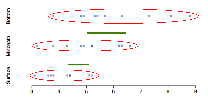
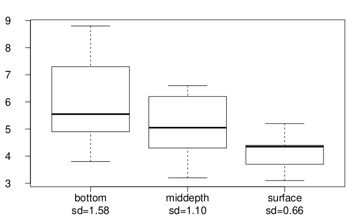

<style>
citation {
  font-size: 4px;
}
</style>

```{r setup, echo = FALSE, warning = FALSE, error = FALSE, message = FALSE}
library(openintro)
knitr::opts_chunk$set(echo = TRUE)
```

# More than Two Means

## Some Context

In our previous lectures, we've discussed single sample means, paired sample means (two
means), and independent sample means (two means). We hinted that something we might
be interested in was more-than-two samples. In this lecture, we will start the
discussion of that idea.

## Case Study: Aldrin in the Wolf River

<center>
```{r, echo=FALSE, out.width = "450px"}
knitr::include_graphics("./fig/aldrin/wolf.png")
```
</center>

* The Wolf River in Tennessee flows past an abandoned site once used by the pesticide industry for dumping wastes, including chlordane (pesticide), aldrin, and dieldrin (both insecticides).
* These highly toxic organic compounds can cause various cancers and birth defects.

## Case Study: Aldrin - Study Methods

* The standard methods to test whether these substances are present in a river is to take samples at six-tenths depth. 
* But since these compounds are denser than water and their molecules tend to stick to particles of sediment, they are more likely to be found in higher concentrations near the bottom than near mid-depth.

## Data

Aldrin concentration (nanograms per liter) at three levels of depth.

```{r, echo = FALSE}
aldrin <- read.csv("./fig/aldrin/aldrin.csv")
aldrin[c(1:4, 10:13, 20:23), ]
```

## Exploratory analysis

Aldrin concentration (nanograms per liter) at three levels of depth. 

<center>
```{r, echo = FALSE, message = FALSE, error = FALSE, warning = FALSE, fig.height = 3}
library(openintro)
library(xtable)
aldrin = read.csv("./fig/aldrin/aldrin.csv", h = T)
par(mar=c(2,4.1,0,0), las=1, mgp=c(3,0.7,0), mfrow = c(3,1), cex.lab = 1.25, cex.axis = 1.25)

dotPlot(aldrin$aldrin[aldrin$depth == "bottom"], xlim = c(3,9), axes = FALSE, col = COL[1,2], xlab = "", ylab = "bottom")
dotPlot(aldrin$aldrin[aldrin$depth == "middepth"], xlim = c(3,9), axes = FALSE, col = COL[1,2], xlab = "", ylab = "middepth")
dotPlot(aldrin$aldrin[aldrin$depth == "surface"], xlim = c(3,9), col = COL[1,2], ylab = "surface")
```
</center>

```{r, echo = FALSE}
dat <- c(c(10, round(mean(aldrin$aldrin[aldrin$depth == "bottom"]),2),
round(sd(aldrin$aldrin[aldrin$depth == "bottom"]),2)),
c(10, round(mean(aldrin$aldrin[aldrin$depth == "middepth"]),2),
round(sd(aldrin$aldrin[aldrin$depth == "middepth"]),2)),
c(10, round(mean(aldrin$aldrin[aldrin$depth == "surface"]),2),
round(sd(aldrin$aldrin[aldrin$depth == "surface"]),2)))
dat <- matrix(dat, nrow = 3, ncol = 3, byrow = TRUE)
desc <- c("bottom", "middepth", "surface")
dat_df <- data.frame(desc, dat)
names(dat_df) <- c("", "n", "mean", "sd")
dat_df
```


## Research question

**Is there a difference between the mean aldrin concentrations among the three levels?**

* To compare means of 2 groups we use a Z or a T statistic.
* To compare means of 3+ groups we use a new test called **ANOVA** and a new statistic called **F**.

## ANOVA

ANOVA is used to assess whether the mean of the outcome variable is different for different levels of a categorical variable.

**$H_0:$** The mean outcome is the same across all categories, 
$$
\mu_1 = \mu_2 = \cdots = \mu_k,
$$
where $\mu_i$ represents the mean of the outcome for observations in category $i$.

**$H_A:$** At least one mean is different than others.

## Conditions

* The observations should be independent within and between groups
    - If the data are a simple random sample from less than 10\% of the population, this condition is satisfied.
    - Carefully consider whether the data may be independent (e.g. no pairing). 
    - Always important, but sometimes difficult to check.
* The observations within each group should be nearly normal.
    - Especially important when the sample sizes are small.

**How do we check for normality?**

* The variability across the groups should be about equal.
    - Especially important when the sample sizes differ between groups.

**How can we check this condition?**

## $z$/$t$ test vs. ANOVA - Purpose

**$z$/$t$ test**

Compare means from **two** groups to see whether they are so far apart that the observed difference cannot reasonably be attributed to sampling variability.
$$
H_0: \mu_1 = \mu_2
$$


**ANOVA**

Compare the means from **two or more** groups to see whether they are so far apart that the observed differences cannot all reasonably be attributed to sampling variability.
$$
H_0: \mu_1 = \mu_2 = \cdots = \mu_k
$$

## $z$/$t$ test vs. ANOVA - Method

**$z$/$t$ test**

Compute a test statistic (a ratio).
$$
z / t = \frac{(\bar{x}_1 - \bar{x}_2) - (\mu_1 - \mu_2)}{SE_{\bar{x}_1 - \bar{x}_2}}
$$

**ANOVA**

Compute a test statistic (a ratio).

$$
F = \frac{\text{variability between groups}}{\text{variability within groups}}
$$

## $z$/$t$ test vs. ANOVA

For both:

* Large test statistics lead to small p-values. 
* If the p-value is small enough $H_0$ is rejected, we conclude that the population means are not equal.

In general: 

* With only two groups t-test and ANOVA are equivalent, but only if we use a pooled standard variance in the denominator of the test statistic.
* With more than two groups, ANOVA compares the sample means to an overall **grand mean**.

## Hypotheses (back to our Case Study)

**What are the correct hypotheses for testing for a difference between the mean aldrin concentrations among the three levels?**

* $H_0: \mu_B = \mu_M = \mu_S \text{  versus  } H_A: \mu_B \ne \mu_M \ne \mu_S$
* $H_0: \mu_B \ne \mu_ M \ne \mu_S \text{  versus  } H_A: \mu_B = \mu_M = \mu_S$ 
* $H_0: \mu_B = \mu_M = \mu_S \text{  versus  } H_A:$ At least one mean is different.
* $H_0: \mu_B = \mu_M = \mu_S = 0 \text{  versus  } H_A:$ At least one mean is different.
* $H_0: \mu_B = \mu_M = \mu_S \text{  versus  } H_A: \mu_B > \mu_M > \mu_S$ 

## Hypotheses

**What are the correct hypotheses for testing for a difference between the mean aldrin concentrations among the three levels?**

* $H_0: \mu_B = \mu_M = \mu_S \text{  versus  } H_A: \mu_B \ne \mu_M \ne \mu_S$
* $H_0: \mu_B \ne \mu_ M \ne \mu_S \text{  versus  } H_A: \mu_B = \mu_M = \mu_S$ 
* **$H_0: \mu_B = \mu_M = \mu_S \text{  versus  } H_A:$ At least one mean is different.**
* $H_0: \mu_B = \mu_M = \mu_S = 0 \text{  versus  } H_A:$ At least one mean is different.
* $H_0: \mu_B = \mu_M = \mu_S \text{  versus  } H_A: \mu_B > \mu_M > \mu_S$ 

# ANOVA and the F test

## Test statistic

**Does there appear to be a lot of variability within groups? How about between groups?**

$$
F = \frac{\text{variability between groups}}{\text{variability within groups}}
$$

<center>
```{r, echo=FALSE, out.width = "450px"}

```
</center>

## Test statistic (cont.)

$$
F = \frac{\text{variability between groups}}{\text{variability within groups}} = \frac{MSG}{MSE}
$$

* **MSG** is Mean Square between Groups
$$
df_G = k - 1
$$
where $k$ is number of groups
* **MSE** is Mean Square Error - variability in residuals
$$
df_E = n - k
$$
where $n$ is number of observations.

## $F$ distribution and p-value

$$
F =  \frac{\text{variability between groups}}{\text{variability within groups}}
$$

<center>
```{r, fig.height = 2, fig.width = 7, echo = FALSE}
FTail <-
  function(U=NULL, df_n=100, df_d = 100, curveColor=1, border=1, col="#569BBD", xlim=NULL, ylim=NULL, xlab='', ylab='', detail=999){
    if(U <= 5){xlim <- c(0,5)}
    if(U > 5){xlim <- c(0,U+0.01*U)}
    temp <- diff(range(xlim))
    x    <- seq(xlim[1] - temp/4, xlim[2] + temp/4, length.out=detail)
    y    <- df(x, df_n, df_d)
    ylim <- range(c(0,y))
    plot(x, y, type='l', xlim=xlim, ylim=ylim, axes=FALSE, col=curveColor, xlab = "", ylab = "")
    these <- (x >= U)
    X <- c(x[these][1], x[these], rev(x[these])[1])
    Y <- c(0, y[these], 0)
    polygon(X, Y, border=border, col=col)
    abline(h=0)
    axis(1, at = c(0,U), label = c(NA,round(U,4)))
  }
par(mar = c(0,0,0,0))
FTail(19,20,2, col = COL[1])
```
</center>
* In order to be able to reject $H_0$, we need a small p-value, which requires a large F statistic.
* In order to obtain a large F statistic, variability between sample means needs to be greater than variability within sample means.


# ANOVA output, deconstructed

## $\;$

```{r}
# our data is stored as a data.frame called aldrin
our_model <- lm(aldrin ~ depth, data = aldrin)
summary( aov( our_model ) )
```

**Degrees of freedom associated with ANOVA**

* groups: $df_G = k - 1$, where $k$ is the number of groups
* total: $df_T = n - 1$, where $n$ is the total sample size
* error: $df_E = df_T - df_G$

## $\;$

```{r, echo = FALSE}
# our data is stored as a data.frame called aldrin, shown on slide 6
our_model <- lm(aldrin ~ depth, data = aldrin)
summary( aov( our_model ) )
```

* $df_G = k - 1 = 3 - 1 = 2$
* $df_T = n - 1 = 30 - 1 = 29$
* $df_E = 29 - 2 = 27$ 

## $\;$

```{r, echo = FALSE}
# our data is stored as a data.frame called aldrin
our_model <- lm(aldrin ~ depth, data = aldrin)
summary( aov( our_model ) )
```

**Sum of squares between groups, SSG**

Measures the variability between groups 
$$
SSG = \sum_{i = 1}^{k} n_i (\bar{x}_i - \bar{x})^2
$$
where $n_i$ is each group size, $\bar{x}_i$ is the average for each group, $\bar{x}$ is the overall (grand) mean.

**I will never make you compute this by hand!**

## $\;$

```{r, echo = FALSE}
# our data is stored as a data.frame called aldrin
our_model <- lm(aldrin ~ depth, data = aldrin)
summary( aov( our_model ) )
```

**Sum of squares total, SST**

Measures the variability between groups 
$$
SST = \sum_{i = 1}^{n} (x_i - \bar{x})
$$
where $x_i$ represent each observation in the dataset.

**Again, not something we do by hand!**

## $\;$

```{r, echo = FALSE}
# our data is stored as a data.frame called aldrin
our_model <- lm(aldrin ~ depth, data = aldrin)
summary( aov( our_model ) )
```

**Sum of squares error, SSE**

Measures the variability within groups:
$$
SSE = SST - SSG
$$

(might make you do this one by hand, because it's easy - so long as
you have SST and SSG already!)

## $\;$

```{r, echo = FALSE}
# our data is stored as a data.frame called aldrin
our_model <- lm(aldrin ~ depth, data = aldrin)
summary( aov( our_model ) )
```

**Mean square error**

Mean square error is calculated as sum of squares divided by the degrees of freedom.

(also easy, also may be asked!)

$$
MSG = 16.96 / 2 = 8.480 \\
MSE = 37.33 / 27 = 1.383
$$

## $\;$

```{r, echo = FALSE}
# our data is stored as a data.frame called aldrin
our_model <- lm(aldrin ~ depth, data = aldrin)
summary( aov( our_model ) )
```

**Test statistic, F value**

As we discussed before, the F statistic is the ratio of the between group and within group variability:
$$
F = \frac{MSG}{MSE}
$$

$$
F = \frac{8.480}{1.383} = 6.134
$$

## $\;$

```{r, echo = FALSE}
# our data is stored as a data.frame called aldrin
our_model <- lm(aldrin ~ depth, data = aldrin)
summary( aov( our_model ) )
```

**p-value**

p-value is the probability of **at least as large** a ratio between the *between group* and *within group* variability, if in fact the means of all groups are equal. It's calculated as the area under the F curve, with degrees of freedom $df_G$ and $df_E$, above the observed F statistic.

## $\;$

```{r, echo = FALSE}
# our data is stored as a data.frame called aldrin
our_model <- lm(aldrin ~ depth, data = aldrin)
summary( aov( our_model ) )
```

<center>
```{r, echo = FALSE, fig.height = 4, fig.width = 8}
plot(x = seq(2, 8, 0.01), y = df(seq(2, 8, 0.01), 2, 27), type = "l", 
     xlab = "", ylab = "F Density",
     main = "F Density with 2 and 27 df")
abline(h = 0)
abline(v = 6.134, col = "red")
text(x = 7, y = 0.05, "p-val", col = "red")
#FTail(df_n = 2, df_d = 27, U = 6.14)
```
</center>


## $\;$

```{r, echo = FALSE}
# our data is stored as a data.frame called aldrin
our_model <- lm(aldrin ~ depth, data = aldrin)
summary( aov( our_model ) )
```

```{r}
pf(q = 6.134, df1 = 2, df2 = 27, lower.tail = FALSE)
```

## Conclusion - in context

**What is the conclusion of the hypothesis test?**

The data provide convincing evidence that the average aldrin concentration

* is different for all groups.
* on the surface is lower than the other levels.
* is different for at least one group.
* is the same for all groups.

## Conclusion - in context

**What is the conclusion of the hypothesis test?**

The data provide convincing evidence that the average aldrin concentration

* is different for all groups.
* on the surface is lower than the other levels.
* **is different for at least one group.**
* is the same for all groups.

## Conclusion

* If p-value is small (less than $\alpha$), reject $H_0$. The data provide convincing evidence that at least one mean is different from (but we can't tell which one).
* If p-value is large, fail to reject $H_0$. The data do not provide convincing evidence that at least one pair of means are different from each other, the observed differences in sample means are attributable to sampling variability (or chance).

# Checking conditions

## (1) independence

**Does this condition appear to be satisfied?**

In this study the we have no reason to believe that the aldrin concentration won't be independent of each other.

## (2) approximately normal

**Does this condition appear to be satisfied?**

<center>
```{r, echo=FALSE, out.width = "650px"}
knitr::include_graphics("./fig/aldrin/normal.png")
```
</center>

## (3) constant variance

**Does this condition appear to be satisfied?**

<center>
```{r, echo=FALSE, out.width = "650px"}

```
</center>

# Multiple comparisons \& Type 1 error rate

## Which means differ?

* Earlier we concluded that at least one pair of means differ. The natural question that follows is **which ones**?
* We can do two sample $t$ tests for differences in each possible pair of groups.

**Can you see any pitfalls with this approach?**

## Pitfalls

* When we run too many tests, the Type 1 Error rate increases.
* This issue is resolved by using a modified significance level.

## Multiple comparisons

* The scenario of testing many pairs of groups is called **multiple comparisons**.
* The **Bonferroni correction** suggests that a more **stringent** significance level is more appropriate for these tests:
$$
\alpha^\star = \alpha / K
$$
where $K$ is the number of comparisons being considered.
* If there are $k$ groups, then usually all possible pairs are compared and $K = \frac{k (k - 1)}{2}$.

## Determining the modified $\alpha$

**In the aldrin data set depth has 3 levels: bottom, mid-depth, and surface. If $\alpha = 0.05$, what should be the modified significance level for two sample $t$ tests for determining which pairs of groups have significantly different means?**

* $\alpha^* = 0.05$
* $\alpha^* = 0.05 / 2 = 0.025$
* $\alpha^* = 0.05 / 3 = 0.0167$
* $\alpha^* = 0.05 / 6 = 0.0083$

## Determining the modified $\alpha$

**In the aldrin data set depth has 3 levels: bottom, mid-depth, and surface. If $\alpha = 0.05$, what should be the modified significance level for two sample $t$ tests for determining which pairs of groups have significantly different means?**

* $\alpha^* = 0.05$
* $\alpha^* = 0.05 / 2 = 0.025$
* <span id="highlight">$\alpha^* = 0.05 / 3 = 0.0167$</span>
* $\alpha^* = 0.05 / 6 = 0.0083$

## Which means differ?

**Based on the box plots below, which means would you expect to be significantly different?**

<center>
```{r, echo=FALSE, out.width = "450px"}

```
</center>

bottom and surface? bottom and mid-depth? mid-depth and surface?
bottom and mid-depth plus mid-depth and surface?
bottom and mid-depth plus bottom and surface plus mid-depth and surface?

## Which means differ? (cont.)

If the ANOVA assumption of equal variability across groups is satisfied, we can use the data from all groups to estimate variability:
 
* Estimate any within-group standard deviation with $\sqrt{MSE}$, which is $s_{pooled}$
* Use the error degrees of freedom, $n - k$, for $t$-distributions

**Difference in two means: after ANOVA**
$$
SE = \sqrt{  \frac{\sigma_1^2}{n_1} + \frac{\sigma_2^2}{n_2} } \approx \sqrt{ \frac{MSE}{n_1} + \frac{MSE}{n_2} }
$$

## $\;$

**Is there a difference between the  average aldrin concentration at the bottom and at mid depth?**

* From the original summary table, mean of bottom is 6.04, mean of middepth is 5.05
* From the ANOVA table, the Residuals have df 27 and Mean Sq 1.38

$$
T_{df_E} = \frac{(\bar{x}_{bottom} - \bar{x}_{middepth})}{\sqrt{ \frac{MSE}{n_{bottom}} + \frac{MSE}{n_{middepth}} }} \qquad \; \qquad
T_{27} = \frac{( 6.04 - 5.05 )}{\sqrt{ \frac{1.38}{10} + \frac{1.38}{10} }} = \frac{0.99}{0.53}  =1.87 \\
\alpha^\star = 0.05 / 3 = 0.0167
$$

## Finish

Find the p-value:
```{r}
pt(q = 1.87, df = 27, lower.tail = FALSE) * 2
```

Then since the test has $\alpha^\star = 0.0167$: **fail to reject $H_0$**, the data do not provide convincing evidence of a difference between the average aldrin concentrations at bottom and mid depth.

## Pairwise: Bottom and Surface

**Is there a difference between the  average aldrin concentration at the bottom and at surface?**

$$
T_{df_E} = \frac{(\bar{x}_{bottom} - \bar{x}_{surface})}{\sqrt{ \frac{MSE}{n_{bottom}} + \frac{MSE}{n_{surface}} }} \qquad \; \qquad
T_{27} = \frac{( 6.04 - 4.02 )}{\sqrt{ \frac{1.38}{10} + \frac{1.38}{10} }} = \frac{2.02}{0.53}  =3.81 \\
\alpha^\star = 0.05 / 3 = 0.0167
$$

```{r}
pt(q = 3.81, df = 27, lower.tail = FALSE)
```

Conclusion: **reject $H_0$**, the data provide convincing evidence of a difference between the average aldrin concentrations at bottom and surface.

## Conclusion, Notes

What we have described in this lecture is known in the literature as
"one-way ANOVA". There is only one factor variable across the data, and 
any data source you use will be stored in a data.frame with two columns only.

This data is the natural output of **experiments** (remember Chapter 1 of our text
from 1051H?), and we will discuss more complicated examples of this later in the
term. This topic plus linear regression are the two most useful and common models used
in science, so pay attention to them - you'll definitely encounter them again!