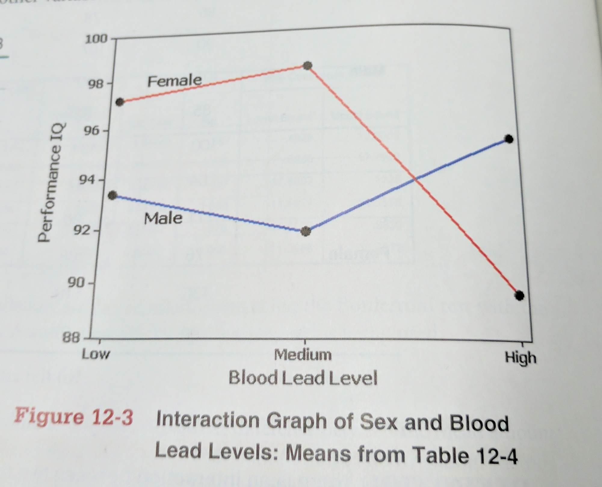

<style>
citation {
  font-size: 4px;
}
</style>

```{r setup, echo = FALSE, warning = FALSE, error = FALSE, message = FALSE}
library(openintro)
knitr::opts_chunk$set(echo = TRUE)
```

# More Than Two Means, Again

## Some Context

In our previous lectures, we've discussed single sample means, paired sample means (two
means), and independent sample means (two means). In a previous lecture, we discussed
the case of "one-way" ANOVA, where we had more than two means, organized by a single
factor. In this lecture, we're going to extend that once more, to the case of 
more than two means, organized by **two** factors.

## Two-Way ANOVA

The last week of content-lectures, and the review earlier in these lectures, was concerning one-way ANOVA, where data was partitioned into categories by one, and only one, factor, which we called "sub-populations" or "populations". Now, we will begin the **two-way analysis of variance**, in which the data is partitioned into categories according to **two** factors. There is some similarity in philosophy in this from the transition from goodness-of-fit to contingency table in Lecture 07; now it's from one-way to two-way ANOVA. 

## Two-Way ANOVA: Requirements

1. Each cell has observations from an approximately normal distribution [hard to check!]
2. All cells have the same $\sigma^2$ [like one-way, this is reasonably robust]
3. The samples that go into the cells are simple random samples
4. The samples are independent of each other (so the cells are independent)
5. The samples are categorized two ways (two factors)  [this is easy]
6. All of the cells are the same size [this is easy]

So of these requirements, 3 and 4 are assumptions, 1 is very hard to check,
and 5 and 6 are trivial (we just look at the data!). The only thing to check
is the "same $\sigma^2$" bit - we mostly just plot a boxplot (example in Workshop 08)
and look at the spreads to see if they're remotely similar. As with
previous one-way ANOVA, this is a fairly robust assumption - they don't have
to be **that** close!

## Two-Way ANOVA

The method of two-way ANOVA begins with testing for an **interaction** between the two factors; then we test the **row factor** effect, and then finally the **column factor** effect. 

**Restriction**: all cells must have the same number of observations, which is known as a **balanced design**. You can violate this setup if you know what you're doing, but
it's not material we'll cover in 1052H.

## Example: Chest Deceleration in Crashes, by Size and Origin of Car

The following table lists chest deceleration measurements (in g): six cells.

$\;$                   Small           Medium          Large
-----------------      -----           ------          ------
Foreign                44              41              32
                       54              49              45
                       43              47              42
Domestic               43              43              37
                       44              37              38
                       42              34              33

## Interaction Plot {.flexbox .vcenter}

We can create an **interaction plot**, which is a simple line plot of the averages of each cell, organized with the values of the averages on the $y$ axis, and the column categories on the $x$. Each row category becomes its own line. Observe:
                       
## Interaction Plot {.flexbox .vcenter}
```{r, echo = FALSE}
means1 <- c(47, 45.7, 39.7)
means2 <- c(43, 38, 36)
plot(1:3, means1, xaxt='n', xlab = "Size", ylab = "Chest Deceleration (g)", col = "red", type = "b", ylim = c(33, 49))
lines(1:3, means2, col = "blue", type = "b")
axis(side = 1, line = 0, at = 1:3, labels = c("Small", "Medium", "Large"))
text(2.7, 44, col = "red", label = "Foreign")
text(2.7, 34, col = "blue", label = "Domestic")
```
                      
## Interpretation

Since both lines decrease with size, but remain approximately parallel (not diverging or crossing), it does not appear that there is an **interaction** between the two categories. Also, the **foreign** variable is consistently higher than the **domestic** variable, which implies that foreign cars have larger measures of chest deceleration. 

## More Interpretation (Opposite Example) {.flexbox .vcenter}

```{r, out.width = "600px", echo = FALSE}

```

## Two-Way ANOVA Procedure

* First, begin by testing the null hypothesis that there is no interaction. Use technology, and read off the $p$-value for the test statistic
$$
F = \frac{MS(Interaction)}{MS(Error)}
$$
Using level $\alpha$, either reject or fail to reject

* If there **is** an interaction effect, **STOP**. 
* If there is **not** an interaction effect, proceed with two additional tests.

## Two-Way ANOVA Procedure (ctd.)

* For the row and column factors, test the null hypotheses ($H_0$: there are no effects from the row (or column) factor), by finding the $p$-value for the test statistic
$$
F = \frac{MS(Row)}{MS(Error)} \qquad \text{ or } \qquad \frac{MS(Column)}{MS(Error)}
$$

## Example

Suppose that Human Resources wants to know if occupational stress varies according to age and gender. The variable of interest (**response**) is occupational stress, as measured by a standardized scale. They have two factors to study: age and gender. 

Age is categorized into less-than-40, 40-55 and 55-and-above. In addition, employees have been labeled by gender: male and female.

## Example (HR and Stress)

$\;$                   Less-Than-40    40--55          55-and-above
-----------------      -----           ------          ------
Male                   73              81              76
                       80              83              74
                       81              79              80
                       76              77              69
Female                 77              77              75
                       79              80              76
                       70              72              74
                       69              68              68
                       
## Example (HR and Stress)

In this design, the age factor has three levels, and the gender factor has two levels, so $3 \times 2 = 6$ total cells. 

Load the data into R:
```{r}
stress <- c(73, 80, 81, 76, 81, 83, 79, 77, 76, 74, 80, 69,
            77, 79, 70, 69, 77, 80, 72, 68, 75, 76, 74, 68)
gender <- c(rep("M", 12), rep("F", 12))
age <- rep(c(rep("A", 4), rep("B", 4), rep("C", 4)), 2)
```

And convert the character vectors into **factors**:
```{r}
gender <- factor(gender, levels = c("M", "F"))
age <- factor(age, levels = c("A", "B", "C"))
```

## Example (HR and Stress)

```{r}
dat <- data.frame(Stress = stress, Gender = gender, Age = age)
str(dat)
```

## Example (HR and Stress)

Now fit the model. Pay close attention to the new syntax!
  
```{r}
mod <- lm(Stress ~ Gender * Age, data = dat)
summary( aov( mod ))
```

You can also use the following syntax if it helps you understand the pieces better
(it's 100% equivalent):
```{r, eval = FALSE}
mod <- lm(Stress ~ Gender + Age + Gender:Age, data = dat)
```

## Example (HR and Stress)

$H_0 (1)$: there is no interaction effect between Gender and Age 

$H_A (1)$: there is an interaction effect between Gender and Age

Conclusion: we do not have evidence at level $\alpha = 0.05$ to conclude that there is an interaction between Gender and Age.
This allows us to continue.

## Example (HR and Stress)

```{r}
mod <- lm(Stress ~ Gender + Age, data = dat)
summary( aov( mod ))
```


## Example (HR and Stress)

$H_0 (2)$: there are no effects on stress from the gender factor 

$H_A (2)$: there is an effect on stress from the gender factor

Conclusion: we **do** have evidence at level $\alpha = 0.05$ to conclude that there is an effect on Stress from Gender.

## Example (HR and Stress)

$H_0 (3):$ there are no effects on stress from the age factor 

$H_A (3):$ there is an effect on stress from the age factor

Conclusion: we do **not** have evidence at level $\alpha = 0.05$ to conclude that there is an effect on Stress from Age.

## Example (HR and Stress)

Overall conclusion: we do not have evidence (at level $\alpha = 0.05$) to conclude that there is an interaction between Gender and Age, and we similarly do not have evidence of an effect on Stress from Age. However, we do have evidence, at level $\alpha = 0.05$ to conclude that there is an effect on Stress levels from the Gender of the employee. 

**Strong Note**: We cannot conclude **what** the effect is, merely that it exists!

## Special Case: One Observation per Cell

In the previous examples, all of the cells have had more than one observation. What happens if we only have one observation per cell?

* With only one observation, there's no variation within the individual cells
* sample variance cannot be computed for individual cells
* without sample variance of cells, we cannot compute the interaction test!

So, our procedure for single observations per cell is:

* pretend there is no interaction
* proceed to analyze the row, and then the column, effects

## Example (HR and Stress again)

What if all we had was one sample per cell? Pretend they don't interact!

$\;$                   Less-Than-40    40--55          55-and-above
-----------------      -----           ------          ------
Male                   73              81              76
Female                 77              77              75

## Example (HR and Stress again)

Then do the analysis:
```{r, echo = FALSE}
dat <- data.frame(Stress = c(73, 81, 76,
                             77, 77, 75) ,
                  Gender = factor(c(rep("M", 3), rep("F", 3))),
                  Age = factor(rep(c(rep("A"), rep("B"), rep("C")), 2), 
                               levels = c("A", "B", "C")))
anova(lm(Stress ~ Gender + Age, data = dat))
```

## Conclusion

Therefore, in this case, we do not have evidence (at level $\alpha = 0.05$) to conclude that there is an effect from either Gender or Age on Stress levels. 

**However**: we were still able to analyze the data! This is the key to this approach.

# Summary

## Summary of ANOVA

There's not a lot of new material in two-way ANOVA, as we already saw most of the key
ideas in the one-way ANOVA. We still use F statistics, we still compute the ANOVA
table, it just has multiple F statistics and multiple rows now. The big, key new ideas
were:

1. The idea of cells
2. The strong emphasis on making sure things are factors
3. The idea of interactions, and the interaction plot

## A Note

I made this note on the assignment (R #3), but I'll make it again here:

**50\% of the questions I get from 4th year students about their research are about ANOVA tables and computing ANOVA, and not knowing how. If you can figure out how to do these problems, you know a really key piece of statistical  ammunition for battling the problems of science!**

# Another Example

## Self-Esteem

A project run by Jannay Morrow at Vassar College studied how levels of 
self-esteem in subjects related to their perceptions of self-esteem
in other (target) people who were described in writing. The self-esteem
levels were measured using the Coopersmith Self-Esteem inventory. We are
interested in testing (at a 0.05 level) this data for similarity across
categories.

## The Data

```{r}
obs <- c(4, 4, 3, 5, 4, 4, 5, 4, 2, 4, 4, 2,
         3, 3, 3, 4, 4, 2, 4, 4, 1, 2, 2, 3,
         3, 1, 3, 3, 3, 5, 3, 2, 3, 3, 3, 3,
         2, 2, 4, 2, 2, 3, 2, 4, 2, 2, 2, 3,
         4, 3, 1, 2, 1, 3, 2, 4, 3, 1, 1, 4,
         3, 2, 3, 2, 3, 4, 3, 4, 4, 3, 3, 4)
target <- c(rep("Low", 36), rep("High", 36))
subject <- c(rep("Low", 12), rep("Medium", 12), rep("High", 12))
subject <- rep(subject, 2)
```

You have to be careful and make sure that each row of the eventual data.frame makes
sense, and is **one** observation (number), and the correct labels. It's not trivial
to setup! Take your time, and maybe sketch it out on paper first. The tables
we provide you are not typically laid out well.

## The Data - Factors

You also need to make sure that the factor variables are ... factors. We
use the **levels** argument to assign the order of our levels - this matters
if there is an ordinal structure in the factor, for interaction plots.

```{r}
target <- factor(target, levels = c("Low", "High"))
subject <- factor(subject, levels = c("Low", "Medium", "High"))
dat <- data.frame(Measure = obs, Self = subject, Target = target)
str(dat)
```

## The Model

We now model this data, with interaction plot first.

```{r, fig.height = 4}
with(dat, 
     interaction.plot(x.factor = Self, trace.factor = Target,
                      response = Measure, type = "b")
    )
```

## Interaction and Model

The previous plot showed what might be an interaction, as the two curves
crossed each other. Let's check the statistics!

```{r}
mod <- lm(Measure ~ Self * Target, data = dat)
summary( aov( mod ))
```

Yup, there's that interaction all right! p-value for
**Self:Target** of 0.0291. So we **do** have an interaction, 
and that means we stop right now. 

## Conclusion of Problem

The null hypothesis here is that there is no interaction between Self
and Target Esteem, and we reject that null, and conclude that there is
an interaction. And once we find an interaction, we do not proceed - we
cannot directly interpret Self or Target without the Interaction getting
in the way. So we're done the analysis as far as 1052H knows how to do it.


