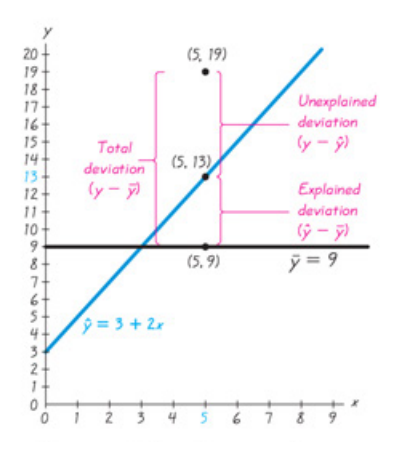

<style>
citation {
  font-size: 4px;
}
</style>

```{r setup, echo = FALSE, warning = FALSE, error = FALSE, message = FALSE}
library(openintro)
knitr::opts_chunk$set(echo = TRUE)
```

## Reminder: How to Complete a Regression Analysis

* begin with a scatterplot, ensure that the pattern is approximately a straight line
* look for outliers, try to determine if the outliers are errors
* estimate the regression
* construct a residual plot, verify no pattern or thicker/thinner
* histogram and/or normal quantile plot for residuals: is it approximately normal?

## Example of a "Good" Regression {.flexbox .vcenter}

```{r, echo = FALSE, fig.height = 4}
x <- sample(seq(1, 20, 0.1), 24)
y <- 2 * x + rnorm(24, sd = 0.5)
res <- y - predict(lm(y ~ x))
qqnorm(y = res, ylim = c(-1.1, 1.1), xlim = c(-2.2, 2.2), main = "QQ Plot")
qqline(y = res)
```

## A note on prediction

**If** we have a good model, then using $\hat{y}$ as the prediction makes sense:
take your $x$, substitute it into $b_0 + b_1 x$, and you're done.

**If you do not have a good model**, then this makes no sense! In this case, the best
prediction we can do is to use $\overline{y}$: just predict the average value, and call it a day!

## Deviation {.flexbox .vcenter}

```{r, out.height = "500px", echo = FALSE}

```

## Deviation

So we can divide deviation into three parts:

* deviation around the mean (total deviation)
* explained deviation around the mean (from regression)
* unexplained deviation around the mean (the leftovers)

## Formally

Assume we have a collection of $(x,y)$ data, and a regression equation that
gives predicted values of $y$ called $\hat{y}$, and the mean of the $y$ values
is $\overline{y}$. 

* **Total deviation**: $y - \overline{y}$
* **Explained deviation**: $\hat{y} - \overline{y}$
* **Unexplained deviation**: $y - \hat{y}$

## This gives ...

$$
y - \overline{y} = (\hat{y} - \overline{y}) + (y - \hat{y})
$$

So **total deviation** is the sum of **explained** and **unexplained**.

## Variation

Same relationship as deviation, just with each element squared.

$$
\sum (y-\overline{y})^2 = \sum (\hat{y} - \overline{y})^2 + \sum (y - \hat{y})^2
$$

## Coefficient of Determination

Remember $r^2$? Lets formally define it twice over:

* $r^2$ is the square of the correlation coefficient (easy, no interpretation ...)
* $r^2$ is the ratio of the **explained variation** to the **total variation**

So, another name for $r^2$ is the **coefficient of determination**, and it is defined as the proportion of the variation in $y$ that is explained by the linear relationship 
between $x$ and $y$. 

## Confidence Intervals

In previous lectures, we have discussed **confidence intervals**. Remember: estimators are actually just educated guesses about a parameter of interest. We're guessing! So confidence intervals are a way to **quantify our uncertainty**: to say "it's probably in this region here". 

## Prediction Intervals

A **prediction interval** is a similar thing: it provides an interval estimate of a predicted value of $y$, from a regression equation or similar.

To create one of these, we require an **E** term, just like in confidence intervals.

## Standard Error of Estimate $s_e$

The **standard error of estimate** is a measure of the differences between the observed (data) $y$ values and the predicted $\hat{y}$ values from the regression equation.

$$
s_e = \sqrt{ \frac{\sum (y-\hat{y})^2}{n-2}}
$$

## Sometimes Easier Formula

An alternative representation is
$$
s_e = \sqrt{\frac{\sum y^2 - b_0 \sum y - b_1 \sum xy}{n-2}}
$$
This formula has the advantage that it uses standard pieces that you might easily have
access to.

## Prediction Interval

Given a particular value $x_0$, the **prediction interval** for the single $y$ associated with that $x_0$ is
$$
\hat{y} - E < y < \hat{y} + E
$$
where
$$
E = t_{\alpha/2} s_e \sqrt{ 1 + \frac{1}{n} + \frac{n(x_0 - \overline{x})^2}{n(\sum x^2) - (\sum x)^2}}
$$

## Confidence Intervals

Recall that we use confidence intervals when we are **estimating** things (that is, computing **estimators**). Prediction intervals are not quite the same thing, as we are not estimating parameters. 

However, in a regression problem, we **are** estimating parameters: $b_0$ and $b_1$ are parameters! So we can: a) compute confidence intervals for them, and b) define hypothesis tests for them! This we've seen before ...

## Hypothesis Tests for parameters $\beta_0$ and $\beta_1$

The test we already know, for the correlation coefficient $\rho$:

$$
H_0: \rho = 0 \qquad \text{versus} \qquad H_A: \rho \neq 0
$$
is equivalent to a test on $\beta_1$, the slope of the linear regression:
$$
H_0: \beta_1 = 0 \qquad \text{versus} \qquad H_A: \beta_1 \neq 0.
$$

## Confidence Interval for $\beta_1$

Since we can perform a hypothesis test for $\beta_1$, we can use the confidence
interval method for $\beta_1$:

$$
\hat{\beta}_1 - E < \beta_1 < \hat{\beta}_1 + E
$$
with
$$
E = t_{\alpha/2} \frac{s_e}{\sqrt{ \sum x^2 - \frac{(\sum x)^2}{n}}}
$$

## Confidence Interval for $\beta_0$

Similarly, 
$$
\hat{\beta}_0 - E < \beta_0 < \hat{\beta}_0 + E
$$
with
$$
E = t_{\alpha/2} s_e \sqrt{ \frac{1}{n} + \frac{\overline{x}^2}{\sum x^2 - \frac{(\sum x)^2}{n}}}
$$

## From Computer Output: $p$-values

```{r, echo = FALSE}
year <- c(1960, 1973, 1986, 1995, 2002, 2003)
pizza <- c(0.15, 0.35, 1.00, 1.25, 1.75, 2.00)
subway <- c(0.15, 0.35, 1.00,1.35, 1.50, 2.00)
```
```{r}
summary(lm(subway ~ pizza))
```

## A New Example: Diamond Prices

The table on the next slide lists weights (carats) and prices (dollars) of randomly selected diamonds. Find the explained variation, and determine the regression equation which best fits the data. Find a confidence interval for $\beta_1$. Find the prediction interval at $95\%$ level for a diamond that weighs 0.8 carats. 

## Data

Weight    Price
------   ------
0.3        510
0.4       1151
0.5       1343
0.5       1410
1.0       5669
0.7       2277

What do we do first?

## Scatterplot {.flexbox .vcenter}
```{r, echo = FALSE}
weight <- c(0.3, 0.4, 0.5, 0.5, 1.0, 0.7)
price  <- c(510, 1151, 1343, 1410, 5669, 2277)
plot(x = weight, y = price, xlab = "weight (carats)", ylab = "price (dollars)")
```

Do we think this is linear? Are there outliers?

## Compute Correlation in R
```{r}
cor.test(weight, price)
```

## Explained Variation

We have $r$, so simply square it: 
$$
r^2 = 0.967637^2 = 0.936
$$
Thus, a linear relationship between the size (in carats) and price (in dollars) of randomly selected diamonds explains $93.6\%$ of the variation in price. 

## Do this in R
```{r}
summary(lm(price ~ weight))
```

## Confidence Intervals
Find the confidence interval for $\beta_1$:
$$
\hat{\beta}_1 - E < \beta_1 < \hat{\beta}_1 + E
$$
with
$$
E = t_{\alpha/2} \frac{s_e}{\sqrt{ \sum x^2 - \frac{(\sum x)^2}{n}}}
$$

```{r}
qt(0.975, 4)
```

## Find $s_e$
$$
\begin{split}
 s_e &= \sqrt{\frac{\sum y^2 - b_0 \sum y - b_1 \sum xy}{n-2}}\\
  &= \sqrt{\frac{42,698,940 + 2006.979 \cdot 12,360 - 7177.021 \cdot 9252.8}{6-2}} \\ 
    &= \sqrt{\frac{1,097,661}{4}} \\
    &= 523.847
\end{split}
$$

Or ...

## Use R again ...

```{r}
mod <- lm(price ~ weight)
summary(mod)
```

## $\;$
So
$$
E = 2.776 \cdot \frac{523.847}{ \sqrt{ 2.24 - \frac{3.4^2}{6}}} = 2597.9.
$$

## Put it together
$$
\begin{split}
7177.021 - 2597.9 < &\beta_1 < 7177.021 + 2597.9 \\
4579.1 < &\beta_1 < 9775.0
\end{split}
$$

This is our 95\% confidence interval for $\beta_1$. Since this confidence interval does not overlap with $0$, we do have evidence at level $\alpha = 0.05$ to conclude that there is a linear relationship between the weight and price of diamonds.

## Or Use R

```{r}
confint(mod)
```

Which one do you think is easier ... ?

## Finally, Prediction Interval

$$
\hat{y} - E < y < \hat{y} + E
$$
where
$$
E = t_{\alpha/2} s_e \sqrt{ 1 + \frac{1}{n} + \frac{n(x_0 - \overline{x})^2}{n(\sum x^2) - (\sum x)^2}}
$$

## Fill in Values
$$
\begin{split}
E &= t_{\alpha/2} s_e \sqrt{ 1 + \frac{1}{n} + \frac{n(x_0 - \overline{x})^2}{n(\sum x^2) - (\sum x)^2}}\\
  &= 2.776 (523.847) \sqrt{ 1 + \frac{1}{6} + \frac{6(0.8 - 0.5667)^2}{6(2.24) - (3.4)^2}}\\
  &= 1484.735 \cdot \sqrt{1.3404} \\
  &= 1718.979 \approx 1719.
\end{split}
$$

## So, prediction interval ...
$$
\begin{split}
(-2007) + 7177 \cdot 0.8 - 1719 < &y < (-2007) + 7177 \cdot 0.8 + 1719 \\
2015.6 < &y < 5453.6.
\end{split}
$$

Thus, our 95\% prediction interval for the value of a 0.8 carat diamond is $(\$2015.60, \$5453.60)$.

## Or Use R

We need a special object to represent the input for X.

```{r}
newdata <- data.frame(weight = 0.8)
predict(mod, newdata, interval="predict") 
```

The difference is just rounding.

## Chapter 9: Multiple Regression

Everything we've considered so far has been two variables, and examining the correlation (linear relationship) between them. In this section, we expand this to consider linear relationships with **more than** two variables.

## Equation

A **multiple regression equation** describes a linear relationship between a response variable
$y$ and two or more predictor variables $(x_1, x_2, \cdots)$. The general form is then
$$
\hat{y} = b_0 + b_1 x_1 + b_2 x_2 + \cdots + b_k x_k.
$$

## Notation

The coefficients we obtain, $b_0, \cdots, b_k$ are sample statistics: educated guesses! We are trying to estimate the underlying population parameters $\beta_0, \cdots, \beta_k$.

**Alternative Notation**: 

 * $b_0 \equiv \hat{\beta_0}$
 * $\cdots$
 * $b_k \equiv \hat{\beta_k}$
 
## Manual Computation?

Even more so than the case of simple linear regression, multiple regression problems progress fully beyond any reasonable level of manual computation. This entire section will be creation, interpretation and discussion of outputs from R (and the material
of Workshops 9, 10 and 11 will be used).

## Example 1: Regression in Heights

The origin of the term **regression** is in the idea of regressing (reverting) toward a mean. If two parents have a child, the aspects of that child tend, on average, to regress (revert) toward the mean of the two parents, and, in fact, the mean of the population. So a very tall man and a short woman who have a child will tend to have an average-height child. 

This is not true for all cases, but is a general statement that seems to hold true. 

## Some height data (inches)
Mother   Father   Daughter
------   ------   --------
63       64       58.6
67       65       64.7
64       67       65.3
60       72       61.0
65       72       65.4
67       72       67.4
59       67       60.9

(total of 20)

## Computer Output
```{r, echo = FALSE}
mother <- c(63, 67, 64, 60, 65, 67, 59, 60, 58, 72, 63, 67, 62, 69, 63, 64, 63, 64, 60, 65)
father <- c(64, 65, 67, 72, 72, 72, 67, 71, 66, 75, 69, 70, 69, 62, 66, 76, 69, 68, 66, 68)
daughter <- c(58.6, 64.7, 65.3, 61, 65.4, 67.4, 60.9, 63.1, 60.0, 71.1, 62.2, 67.2, 63.4, 68.4, 62.2, 64.7, 59.6, 61.0, 64.0, 65.4)
```
```{r, eval = FALSE}
summary(lm(daughter ~ father + mother))
```
<pre>
Coefficients:
            Estimate Std. Error t value Pr(>|t|)    
(Intercept)   7.4543    10.8804   0.685    0.503    
father        0.1636     0.1266   1.293    0.213    
mother        0.7072     0.1289   5.488    4e-05 ***
---
Signif. codes:  0 ‘***’ 0.001 ‘**’ 0.01 ‘*’ 0.05 ‘.’ 0.1 ‘ ’ 1

Residual standard error: 1.94 on 17 degrees of freedom -->
Multiple R-squared:  0.6752,	Adjusted R-squared:  0.637 
F-statistic: 17.67 on 2 and 17 DF,  p-value: 7.057e-05
</pre>

## Pulling out critical things
We see a number of things. The first is the regression equation:
$$
\text{daughter} = 7.4543 + 0.1636\cdot \text{father} + 0.7072\cdot \text{mother},
$$
while the second is the $R^2$ value, $R^2 = 67.5\%$. We also see that the **adjusted $R^2$** is listed as $63.7\%$, and that the $p-$value (overall) is $7.06\times 10^{-5}$, a small number.

## What do these mean?

We will spend the next lecture exploring what these items mean, and working through the process of actually **doing** a multiple regression in practice.

